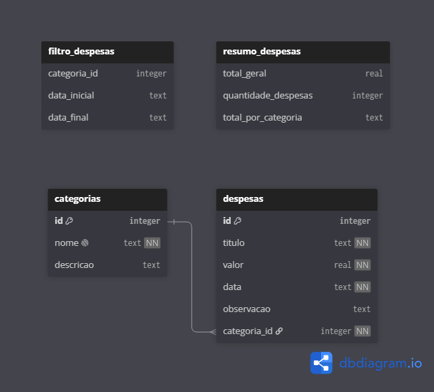

<div align="center">
  <h1>Controle de Despesas Pessoais</h1>
  <p>
    Aplicacao fullstack para organizar categorias, registrar despesas e acompanhar
    um resumo simples dos gastos.
  </p>
</div>

<p align="center">
  
</p>

## Sobre

Este projeto foi desenvolvido como uma aplicacao fullstack pequena, com foco em
clareza arquitetural, persistencia local e separacao de responsabilidades.

O sistema permite gerenciar categorias e despesas, mantendo os dados em SQLite e
exibindo a interface em um frontend estatico com Bootstrap.

## Arquitetura

A aplicacao foi organizada como monorepo:

```text
apps/
  api/   Backend Node.js com SQLite
  web/   Frontend estatico com Bootstrap
docs/    Documentacao do projeto
scripts/ Automacoes locais
```

O backend segue uma arquitetura em camadas:

```text
Route -> Controller -> Service -> Model -> SQLite
```

Essa divisao mantem cada parte do sistema com uma responsabilidade clara:

- `routes` mapeiam as URLs da API;
- `controllers` traduzem requisicoes HTTP para chamadas internas;
- `services` concentram regras de negocio;
- `models` acessam o banco com SQL puro;
- `db.js` inicializa o SQLite e cria o schema.

## Stack

| Camada | Tecnologias |
| --- | --- |
| Frontend | HTML, CSS, JavaScript, Bootstrap 5 |
| Backend | Node.js, `node:http` |
| Banco | SQLite com `node:sqlite` |
| Deploy | Vercel, Fly.io |

## Funcionalidades

- Cadastro e manutencao de categorias.
- Cadastro e manutencao de despesas.
- Vinculo entre despesa e categoria.
- Filtro de despesas por categoria.
- Resumo com total gasto e contadores principais.
- Persistencia dos dados em SQLite.

## Como executar

Requisito:

```text
Node.js 22 ou superior
```

Na raiz do projeto:

```bash
npm run dev
```

Servicos locais:

```text
Frontend: http://localhost:5173
API:      http://localhost:3000
```

Para rodar separadamente:

```bash
npm run dev:web
npm run dev:api
```

## Testes

O projeto possui um smoke test para validar os principais fluxos da API.

```bash
npm test
```

Esse teste usa SQLite em memoria, cria dados temporarios e verifica o fluxo
principal sem alterar o banco local.

## Deploy

O deploy foi separado por responsabilidade:

| Parte | Plataforma |
| --- | --- |
| Frontend | Vercel |
| Backend | Fly.io |
| Banco | SQLite em Fly Volume |

No frontend, a URL da API e gerada no build a partir da variavel:

```text
API_BASE_URL
```

Localmente, o arquivo `apps/web/assets/config.js` aponta para `localhost`. Em
producao, o build da Vercel gera esse mesmo arquivo apontando para a API publicada
no Fly.io.

## Documentacao

- [Banco, utils e rotas](./docs/BANCO_UTILS_ROTAS.md)
- [Roteiro de apresentacao](./docs/APRESENTACAO_E_DEPLOY.md)
- [Deploy com Vercel e Fly.io](./docs/DEPLOY_VERCEL_FLY.md)
- [OpenAPI](web/docs/openapi.yaml)

## Estrutura principal

```text
apps/api/src
  controllers/
  models/
  routes/
  services/
  utils/
  app.js
  db.js
  server.js

apps/web
  assets/
  scripts/
  index.html
  server.js
```

## Decisoes tecnicas

- SQLite foi usado para manter o projeto simples e persistente.
- SQL fica isolado nos models.
- Regras de negocio ficam nos services.
- Prepared statements evitam concatenacao direta em SQL.
- O backend usa HTTP nativo para manter o fluxo didatico e transparente.
- O frontend e estatico, facilitando publicacao na Vercel.
- O backend foi publicado no Fly.io para suportar Node.js com volume persistente.
